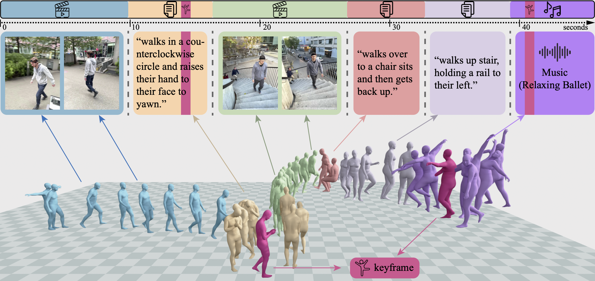

<p align="center">
 <h1 align="center"> GEM: A Generalist Model for Human Motion</h1>
  <p align="center">
    <a href="https://jeffli.site/"><strong>Jiefeng Li</strong></a>
    ·
    <a href="https://www.jinkuncao.com/"><strong>Jinkun Cao</strong></a>
    ·
    <a href="https://cs.stanford.edu/~haotianz/"><strong>Haotian Zhang</strong></a>
    ·
    <a href="https://davrempe.github.io/"><strong>Davis Rempe</strong></a>
    ·
    <a href="https://jankautz.com/"><strong>Jan Kautz</strong></a>
    ·
    <a href="https://www.umariqbal.info/"><strong>Umar Iqbal</strong></a>
    ·
    <a href="https://ye-yuan.com/"><strong>Ye Yuan</strong></a>
  </p>
  <h2 align="center">ICCV 2025 (Highlight)</h2>
  <div align="center">
    
  </div>
</p>
<p align="center">
  <a href="https://research.nvidia.com/labs/dair/gem/"></a>
  <a href="https://arxiv.org/abs/2505.01425"></a>

</p>

**GEM** is a generalist model for human motion that handles multiple tasks with a single model, supporting diverse conditioning signals including video, keypoints, text, audio, and 3D keyframes.

---

## 📰 News
- **[December 2025]** 📢 GENMO has been renamed to **GEM**.
- **[October 2025]** 📢 The **GEM** codebase is **released!**  
  Stay tuned for the pretrained models and evaluation scripts.  
  Follow the [project page](https://research.nvidia.com/labs/dair/gem/) for updates and announcements.


---


## 🚀 Highlights

GEM introduces a **unified generative framework** that connects motion estimation and generation through shared objectives.

- **Unified framework:** Reframes motion estimation as *constrained generation*, allowing a single model to perform both tasks.  
- **Regression × Diffusion synergy:** Combines the accuracy of regression models with the diversity of diffusion-based generation.  
- **Estimation-guided training:** Trains effectively on in-the-wild datasets using only 2D or textual supervision.  
- **Multimodal conditioning:** Supports video, text, audio, 2D/3D keyframes, or even time-varying mixed inputs (e.g., video → text → video).  
- **Arbitrary-length motion:** Generates continuous, coherent sequences of any duration in one diffusion pass.  
- **State-of-the-art performance:** Achieves leading results on diverse motion estimation and generation benchmarks.

For more details, visit the **[GEM project page →](https://research.nvidia.com/labs/dair/gem/)**

---

## 📦 Installation

### Prerequisites

- **Python**: 3.10 (required - pytorch3d wheel is only available for Python 3.10)
- **CUDA**: 12.1+ (for GPU acceleration)
- **Git**: For cloning the repository

### Step 1: Clone the Repository

```bash
git clone  --recurse-submodules <repository_url>
cd GENMO
```

### Step 2: Create Virtual Environment

**Option A: Using UV (Recommended - Faster)**

```bash
# Install UV if you don't have it
curl -LsSf https://astral.sh/uv/install.sh | sh

# Create virtual environment with Python 3.10 (required for pytorch3d compatibility)
uv venv --python 3.10
source .venv/bin/activate  # Linux/Mac
# or: .venv\Scripts\activate  # Windows
```

**Option B: Using Conda**

```bash
conda create -n genmo python=3.10
conda activate genmo
```

**Option C: Using Python venv**

```bash
python3.10 -m venv .venv
source .venv/bin/activate  # Linux/Mac
# or: .venv\Scripts\activate  # Windows
```

### Step 3: Install Dependencies

**Using UV (Recommended)**

```bash
# Install main project dependencies
uv pip install -e .

# Install pytorch3d (required for GVHMR, must be Python 3.10)
uv pip install "pytorch3d @ https://dl.fbaipublicfiles.com/pytorch3d/packaging/wheels/py310_cu121_pyt230/pytorch3d-0.7.6-cp310-cp310-linux_x86_64.whl"

# Install pycolmap (required for GVHMR)
uv pip install pycolmap
```

**Using pip**

```bash
pip install -r requirements.txt
pip install -e .

# Install pytorch3d (required for GVHMR, must be Python 3.10)
pip install "pytorch3d @ https://dl.fbaipublicfiles.com/pytorch3d/packaging/wheels/py310_cu121_pyt230/pytorch3d-0.7.6-cp310-cp310-linux_x86_64.whl"

# Install pycolmap (required for GVHMR)
pip install pycolmap
```

### Step 4: Install GVHMR

Install GVHMR as an editable package and its dependencies (required for imports to work):

```bash
cd third_party/GVHMR
# Install GVHMR dependencies first
uv pip install -r requirements.txt  # or: pip install -r requirements.txt
# Then install GVHMR as editable package
uv pip install -e .  # or: pip install -e .
cd ../..
```

**Note**: GVHMR must be installed as an editable package so that the `hmr4d` module can be imported correctly. Installing its requirements ensures all dependencies (including pycolmap) are available.

### Step 5: Download Pretrained Models

1. **Download GENMO Checkpoints**:
   - Download from [Google Drive](https://drive.google.com/file/d/1b1E84G7S0h2n5o0RmrcmKOhRKukOjgsJ/view?usp=sharing)
   - Place the checkpoint file (e.g., `s050000.ckpt`) in `inputs/checkpoints/` directory
   - Example: `inputs/checkpoints/s050000.ckpt`

2. **Download ViTPose Checkpoint** (required for 2D pose estimation in video mode):

   ```bash
   mkdir -p inputs/checkpoints/vitpose
   wget -q --show-progress -c \
     "https://huggingface.co/camenduru/GVHMR/resolve/main/vitpose/vitpose-h-multi-coco.pth" \
     -O inputs/checkpoints/vitpose/vitpose-h-multi-coco.pth
   ```

   - Required file: `inputs/checkpoints/vitpose/vitpose-h-multi-coco.pth`

3. **Download GVHMR & HMR2 Checkpoints** (required for video-based motion estimation):

   ```bash
   mkdir -p inputs/checkpoints/gvhmr inputs/checkpoints/hmr2
   wget -q --show-progress -c \
     "https://huggingface.co/camenduru/GVHMR/resolve/main/gvhmr/gvhmr_siga24_release.ckpt" \
     -O inputs/checkpoints/gvhmr/gvhmr_siga24_release.ckpt
   wget -q --show-progress -c \
     "https://huggingface.co/camenduru/GVHMR/resolve/main/hmr2/epoch%3D10-step%3D25000.ckpt" \
     -O "inputs/checkpoints/hmr2/epoch=10-step=25000.ckpt"
   ```

   - Required files:
     - `inputs/checkpoints/gvhmr/gvhmr_siga24_release.ckpt`
     - `inputs/checkpoints/hmr2/epoch=10-step=25000.ckpt`

### Step 6: Download SMPL/SMPLX Body Models

#### SMPLX Models

1. **Register and Download**:
   - Visit [SMPL-X website](https://smpl-x.is.tue.mpg.de/)
   - Sign up and agree to the license terms
   - Download the SMPLX models (`.npz` format)

2. **Place Models**:
   ```bash
   mkdir -p inputs/checkpoints/body_models/smplx
   ```
   - Copy the downloaded files to `inputs/checkpoints/body_models/smplx/`
   - Required files:
     - `SMPLX_NEUTRAL.npz`
     - `SMPLX_MALE.npz` (optional)
     - `SMPLX_FEMALE.npz` (optional)

#### SMPL Models

1. **Register and Download**:
   - Visit [SMPL website](https://smpl.is.tue.mpg.de/)
   - Sign up and agree to the license terms
   - Download **SMPL for Python Users** (version 1.1.0 recommended)
   - You need: `basicmodel_neutral_lbs_10_207_0_v1.1.0.pkl`

2. **Place Models**:
   ```bash
   mkdir -p inputs/checkpoints/body_models/smpl
   ```
   - Copy `basicmodel_neutral_lbs_10_207_0_v1.1.0.pkl` to `inputs/checkpoints/body_models/smpl/`
   - Rename it to `SMPL_NEUTRAL.pkl` (or keep original name - the code should handle both)

#### Auxiliary Files

The auxiliary files are already included in the repository at `third_party/GVHMR/hmr4d/utils/body_model/`. You need to copy them to the correct directory:

1. **`smplx2smpl_sparse.pt`**: SMPLX to SMPL conversion matrix
2. **`smpl_neutral_J_regressor.pt`**: SMPL joint regressor

Copy both files to `inputs/checkpoints/body_models/`:

```bash
# Make sure the directory exists
mkdir -p inputs/checkpoints/body_models

# Copy the files from third_party
cp third_party/GVHMR/hmr4d/utils/body_model/smplx2smpl_sparse.pt inputs/checkpoints/body_models/
cp third_party/GVHMR/hmr4d/utils/body_model/smpl_neutral_J_regressor.pt inputs/checkpoints/body_models/

# Place the files:
# - inputs/checkpoints/body_models/smplx2smpl_sparse.pt
# - inputs/checkpoints/body_models/smpl_neutral_J_regressor.pt
```

## 🚀 Quick Start

### Generate Motion from Text

Generate human motion from a text description:

```bash
python scripts/demo/demo_text.py \
    text1="a person walks forward" \
    text_length=300 \
    exp=genmo_lg \
    ckpt_path=outputs/s050000.ckpt \
    rsync_ckpt=false
```

**Parameters:**
- `text1`: Text description of the motion (use single quotes `'...'` if text contains commas or periods)
- `text_length`: Number of frames to generate (default: 300, ~10 seconds at 30 FPS)
- `exp`: Experiment configuration name (e.g., `genmo_lg`)
- `ckpt_path`: Direct path to checkpoint file
- `output_dir`: Output directory (optional, default: `outputs/demo/<text_name>`)
- `rsync_ckpt`: Set to `false` to use only local checkpoints

**Example with complex text:**

```bash
python scripts/demo/demo_text.py \
    text1='do a soccer comemoration. look around, jump 3 times putting your arms up' \
    text_length=360 \
    output_dir=outputs/demo/soccer_comemoration \
    exp=genmo_lg \
    ckpt_path=inputs/checkpoints/s050000.ckpt \
    rsync_ckpt=false
```

### Generate Motion from Video

Generate human motion from an input video:

```bash
python scripts/demo/demo_text.py \
    video1_path=/path/to/your/video.mp4 \
    video1_name=my_video \
    output_dir=outputs/demo/my_video \
    exp=genmo_lg \
    ckpt_path=inputs/checkpoints/s050000.ckpt \
    rsync_ckpt=false \
    static_cam1=true \
    orig_fps1=30
```

**Parameters:**
- `video1_path`: Path to input video (required for video mode)
- `video1_name`: Video name (optional, uses filename if not specified)
- `static_cam1`: Set to `true` for static camera (faster, less accurate), `false` for moving camera (requires DROID-SLAM)
- `orig_fps1`: Original video FPS (default: 30)
- `verbose`: Set to `true` to generate debug videos (bounding boxes, 2D keypoints)

**Example with static camera:**

```bash
python scripts/demo/demo_text.py \
    video1_path=/home/user/videos/person_walking.mp4 \
    video1_name=person_walking \
    output_dir=outputs/demo/person_walking \
    exp=genmo_lg \
    ckpt_path=inputs/checkpoints/s050000.ckpt \
    rsync_ckpt=false \
    static_cam1=true \
    orig_fps1=30
```

### Generate Motion from Music

Generate a 3D dance animation conditioned on an audio file:

```bash
python scripts/demo/demo_music.py \
    music_path=/path/to/your/song.wav \
    music_duration=30 \
    exp=genmo_lg \
    ckpt_path=inputs/checkpoints/s050000.ckpt \
    rsync_ckpt=false
```

**Parameters:**
- `music_path`: Path to the input audio file (`.wav`, `.mp3`, etc.)
- `music_duration`: Duration in seconds to process (optional — omit to use the full audio)
- `music_fps`: Frame rate for music feature extraction (default: `30`)
- `exp`: Experiment configuration name (e.g., `genmo_lg`)
- `ckpt_path`: Direct path to checkpoint file
- `output_dir`: Output directory (optional, default: `outputs/demo/demo_music/<audio_stem>`)
- `rsync_ckpt`: Set to `false` to use only local checkpoints

**Example:**

```bash
python scripts/demo/demo_music.py \
    music_path=inputs/music/wuthering_heights.wav \
    music_duration=30 \
    output_dir=outputs/demo/demo_music/wuthering \
    exp=genmo_lg \
    ckpt_path=inputs/checkpoints/s050000.ckpt \
    rsync_ckpt=false
```

**Notes:**
- The model is conditioned on 35-dimensional music features extracted at 30 FPS, matching the AIST++ training format.
- The final output video is automatically merged with the original audio using `ffmpeg`.

---

### Output Files

All modes generate output files in `outputs/demo/<name>/`:

- `hmr4d_results.pt`: Generated SMPLX parameters (used for visualization and conversion)
- `2_global.mp4`: Rendered video of motion in global coordinates (with audio, for music mode)
- `3_incam_global_horiz.mp4`: Combined video with input text/video

For more detailed usage instructions, see [DEMO_SMPLX.md](DEMO_SMPLX.md).

---

## 📖 Paper & Citation

**Paper:**  
[GENMO: A GENeralist Model for Human MOtion](https://arxiv.org/abs/2505.01425)  
*Jiefeng Li, Jinkun Cao, Haotian Zhang, Davis Rempe, Jan Kautz, Umar Iqbal, Ye Yuan*  
ICCV, 2025

**BibTeX:**
```bibtex
@inproceedings{genmo2025,
  title     = {GENMO: A GENeralist Model for Human MOtion},
  author    = {Li, Jiefeng and Cao, Jinkun and Zhang, Haotian and Rempe, Davis and Kautz, Jan and Iqbal, Umar and Yuan, Ye},
  booktitle = {Proceedings of the IEEE/CVF International Conference on Computer Vision (ICCV)},
  year      = {2025}
}
